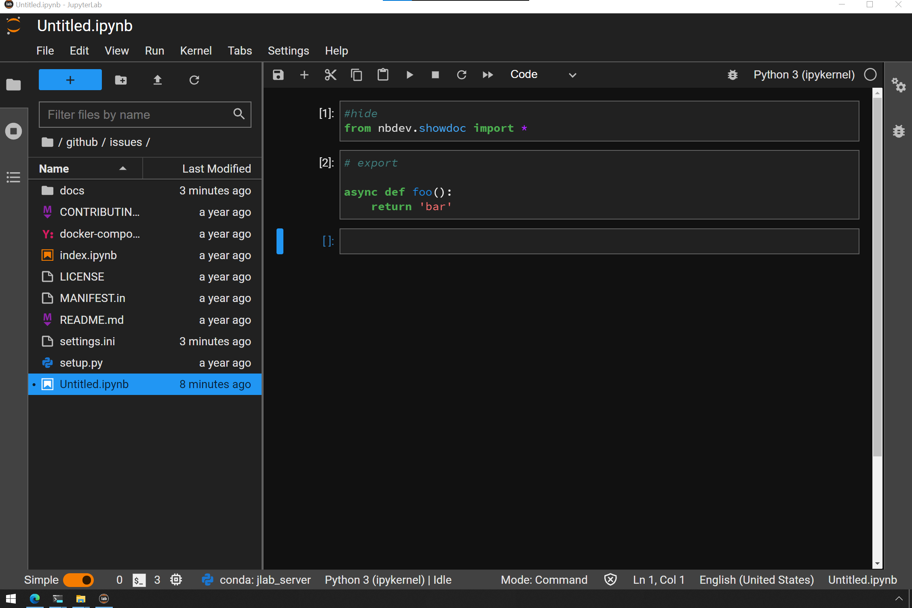

# nbdev async issues
> Bleeding on the bleeding edge


## Install

`Don't`

## How to use

(https://github.com/fastai/nbdev/issues/327). This is a bare-bones example of attempting to produce documentation for an nbdev Notebook with an async function. If you are an nbdev developer, follow [this link] for the open Github issue, also documented below.

This may be the same issue. I'm on Windows 10 with WSL2. On Linux I'm running Ubuntu 20.04.4 LTS. I use Jupyter Desktop Version 3.3.2-2. I'm on nbdev 1.2.5 on both the Linux and Windows sides. So I do Notebooks under Windows Desktop JupyterLab and the nbdev_[commands] under WSL2/Linux/focal 20.04.4. The problem is extremely consistent and reproducible.

The process is:

    Make new folder.
    Create Notebook.
    Turn it into git repo.
    Add git endpoint.
    Run nbdev_new.
    Put in hidden showdoc block.
    Add an async function to an export cell.
    Attempt running nbdev_build_docs. Get this error:

```bash
(py310) ubuntu@LunderVand:/mnt/c/Users/mikle/github/issues$ git branch -M main
(py310) ubuntu@LunderVand:/mnt/c/Users/mikle/github/issues$ git remote add origin git@github.com:miklevin/issues.git
(py310) ubuntu@LunderVand:/mnt/c/Users/mikle/github/issues$ nbdev_new
Executing: git config --local include.path ../.gitconfig
Success: hooks are installed and repo's .gitconfig is now trusted
(py310) ubuntu@LunderVand:/mnt/c/Users/mikle/github/issues$ nbdev_build_docs
converting: /mnt/c/Users/mikle/github/issues/index.ipynb
converting: /mnt/c/Users/mikle/github/issues/Untitled.ipynb
An error occurred while executing the following cell:
------------------
show_doc(foo, default_cls_level=2, show_all_docments=False)
------------------

---------------------------------------------------------------------------
NameError                                 Traceback (most recent call last)
/tmp/ipykernel_3836/4040911153.py in <module>
----> 1 show_doc(foo, default_cls_level=2, show_all_docments=False)

NameError: name 'foo' is not defined
NameError: name 'foo' is not defined

Conversion failed on the following:
Untitled.ipynb
Traceback (most recent call last):
  File "/home/ubuntu/py310/bin/nbdev_build_docs", line 8, in <module>
    sys.exit(nbdev_build_docs())
  File "/home/ubuntu/py310/lib/python3.10/site-packages/fastcore/script.py", line 113, in _f
    tfunc(**merge(args, args_from_prog(func, xtra)))
  File "/home/ubuntu/py310/lib/python3.10/site-packages/nbdev/export2html.py", line 649, in nbdev_build_docs
    if fname is None: make_sidebar()
  File "/home/ubuntu/py310/lib/python3.10/site-packages/nbdev/export2html.py", line 717, in make_sidebar
    create_default_sidebar()
  File "/home/ubuntu/py310/lib/python3.10/site-packages/nbdev/export2html.py", line 709, in create_default_sidebar
    dic = {get_config().lib_name: _create_default_sidebar()}
  File "/home/ubuntu/py310/lib/python3.10/site-packages/nbdev/export2html.py", line 701, in _create_default_sidebar
    for t,f in groupby(names, _get_title).items():
  File "/home/ubuntu/py310/lib/python3.10/site-packages/fastcore/basics.py", line 536, in groupby
    for o in x: res.setdefault(key(o), []).append(val(o))
  File "/home/ubuntu/py310/lib/python3.10/site-packages/nbdev/export2html.py", line 690, in _get_title
    with open(fname, 'r') as f: code = f.read()
FileNotFoundError: [Errno 2] No such file or directory: '/mnt/c/Users/mikle/github/issues/docs/Untitled.html'
(py310) ubuntu@LunderVand:/mnt/c/Users/mikle/github/issues
```


